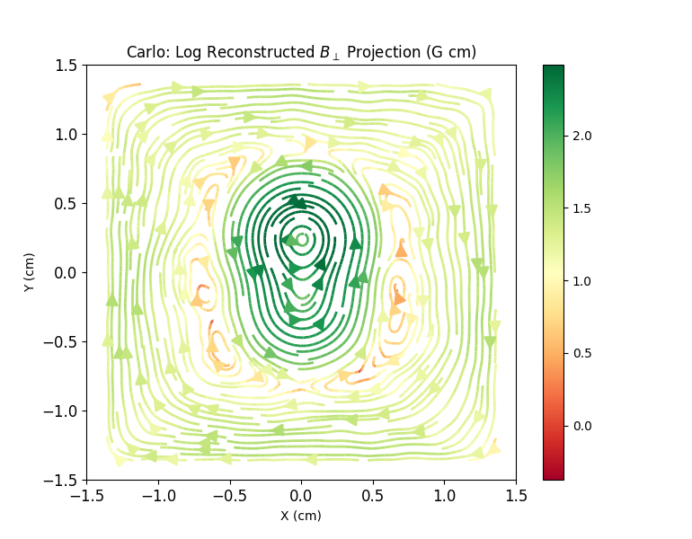
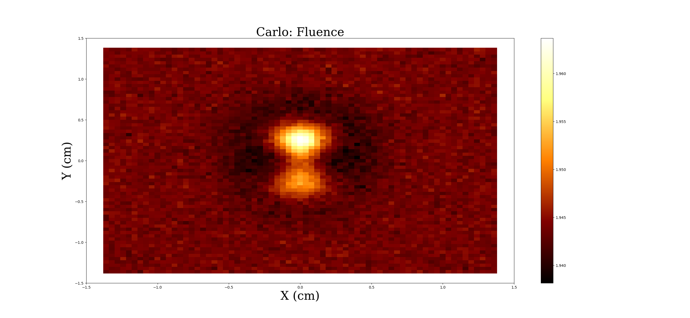

# Linear Proton Radiography Reconstruction

Proton radiography is an experimental technique used to reveal the magnetic fields found in high-energy density plasma experiments using beams of protons. The proton beams are either produced by imploding capsules, which release a short pulse of mono-energetic protons at stagnation, or by thermally produced protons accelerated through extreme electric field gradients. The usual proton energies are between 3 and 30MeV and are driven through a magnetic field in a plasma experiment, where the path is shifted by the Lorentz force and then come to stop at the screen. The positions on the screen are recorded along with initial conditions. Under certain experimental conditions, the full structure of the perpendicular magnetic field can be reconstructed by solving a steady- state inhomogeneous two-dimensional diffusion equation. The code presented is a Python package developed at the University of Chicago to analyze proton radiography experimental radiographs in the linear (small-image contrast) regime. This code is based on work by Graziani et al. 2017 (in press).

The Graziani et al. 2017 paper upon which this code is based may be found [here](https://arxiv.org/abs/1603.08617).

# Setup

## Dependencies
This module requires **Python 2.7** or **3.5**. Installation requires **git**.

**OS X users:** Prior to installing dependencies, ensure an adequate Python installation by following [this guide](https://matplotlib.org/faq/installing_faq.html#osx-notes). The Python that ships with OS X may not work well with some required dependencies.

The following Python packages are required:
* future (Cross-compatibility between Python2 and Python3)
* numpy (Scientific computing)
* scipy (Scientific computing)
* matplotlib (Plotting)
* pandas (Parsing Large files)
* pradreader (https://github.com/jtlaune/pradreader) (Reading various proton radiograph file formats)

On most systems (see above note for OS X), they can be installed using Python's [PIP package manager](https://packaging.python.org/tutorials/installing-packages/) as follows:

```shell
pip install future
pip install numpy scipy matplotlib pandas
pip install git+https://github.com/jtlaune/pradreader
```

Depending on how Python was installed on your system, `pip` may require *Administrative* or `sudo` privileges.

## Installation
Once all dependencies are satisfied, install the latest version of **lin_prad** by:

```shell
pip install git+https://github.com/AlemayehuB/lin_prad
```

The module can also be installed by:

```shell
git clone https://github.com/AlemayehuB/lin_prad
cd lin_prad
python setup.py install
```

# Usage
## Requirements
An intermediate file is created using the [pradreader python package](https://github.com/jtlaune/pradreader).

An intermediate file that contains the variables such as:
* Distance from proton source to the interaction region(cm), s2r_cm
* Distance from proton source to the screen(cm), s2d_cm 
* Proton Kinetic Energies (MeV), Ep_MeV
* flux image which is a matrix with number of protons per bin of the screen which is dependent on the inputted bin length, flux
* flux reference which is the flux image if there were no interaction region


## Command Line Tools

Supported file formats include any that pradreader supports, including radiographs generated from FLASH simulations and MIT's CR39 proton radiography analysis
### Tool 1: "lin-reconstruct"

A command line tool for reconstructing the magnetic field of the data from a proton radiography experiment given an intermediate file with the requirements above. It outputs streamplots based on the reconstruction algorithim  
#### Usage
```shell
lin-reconstruct [options] [input file] [file type] [bin length(microns)]
```
##### Options

| Option | Action |
|:-------|--------|
|--tol| The Gauss-Seidel tolerance. DEFAULT:1.0E-04 |
|--iter| The number of Gauss-Seidel iterations. DEFAULT:4000|

**The number of Gauss-Seidel iterations**: This number represents the number of iterations that in the Gauss-Seidel method. Changing this number may affect the results if it hasn't reached converegence.

**The Gauss-Seidel tolerance**: This number represents  limit  and a resudial value that is calculated every iteration. If the resudial value reaches this limit the Gauss-Seidel method should stop.

For more info check out pages 8 and 9: https://arxiv.org/abs/1603.08617

#### Example 
```shell
lin-reconstuct --tol 1.0E-05 --iter 8000 myfile.txt flash4 320
```
This command line script ensures that Gauss-Seidel Tolerance is 1.0E-05 and the number of Gauss-Seidel Iterations 8000 and parses myfile.txt that has a file type of flash4 and a bin length of 320 micron
#### Output

The tool outputs Log Reconstructed Perpendicular Magnetic Field Projection
<p align="center">

</p>


### Tool 2: "lin-analyze"

A command line tool for analysis of a proton radiography experiment. Analysis is done by plotting a 2D matrices each value is considered a pixel on the graph and the number of pixels is determinded by the bin size that the user inputs. The 2D matrices are the flux and fluence(fluence distribution of protons) plot. 

#### Usage
```shell
lin-analyze [input file] [file type] [bin length(microns)]
```
#### Example
```shell
lin-analyze myfile.txt flash4 400
```
This command line parses myfile.txt that has a file type of flash4 and a bin length of 320 micron
#### Output

The tool outputs a flux and fluence contrast plot 
<p align="center">
 
</p>
<p align="center">
 
</p>

# Updating/Uninstalling
> Write up how to update a current installation (and how to update dependencies as well), how to uninstall it

To update **PRaLine** at a later date, ...

To uninstall **PRaLine**
```shell
pip uninstall PRaLine
```
